# 🎭 Sentiment Analysis Transformer

<div align="center">
  

  <a href="https://colab.research.google.com/github/ayushmandas29/sentiment-analysis-transformer/blob/main/Sentiment_Analysis_Pipeline.ipynb"></a>
  <br/><br/>
  <i>A lightning-fast Natural Language Processing pipeline leveraging HuggingFace's DistilBERT to classify text sentiment with high accuracy.</i>
</div>

<br/>

## 🧠 The Brains Behind the Operation
<p align="center">
  
</p>
<p align="center">
  <a href="https://huggingface.co/"></a>
  
</p>

---

## ⚙️ How It Works (Visual Workflow)

```mermaid
graph LR
    A[Raw Text Data] --> B(Tokenization)
    B --> C{DistilBERT Transformer}
    C -->|High Confidence| D((😃 POSITIVE))
    C -->|High Confidence| E((😡 NEGATIVE))
    
    style A fill:#1e1e1e,stroke:#fff
    style B fill:#4b0082,stroke:#fff
    style C fill:#8a2be2,stroke:#fff
    style D fill:#2ecc71,stroke:#fff,color:#000
    style E fill:#e74c3c,stroke:#fff
```



<br/>

## ✨ Core Features
- **Lightweight Architecture**: Uses **DistilBERT**, which is 40% smaller and 60% faster than BERT while retaining 97% of its language understanding.
- **Zero-Shot Pipeline Ready**: Implemented utilizing HuggingFace's native `pipeline("sentiment-analysis")`.
- **Automatic Evaluation**: Generates predictions against a 20-sample validation dataset.
- **Data Visualization**: Includes Scikit-learn, Matplotlib, and Seaborn for plotting evaluation metrics and confusion matrices.

<br/>

## 🚀 Quick Start
You don't need to download any external datasets or configure local hardware. The environment handles everything internally!

**Method 1: Google Colab (Recommended)**
1. Click the **"Open in Colab"** badge at the top of this page.
2. Hit `Runtime` ➡️ `Run All`.

**Method 2: Local Execution**
```bash
git clone https://github.com/ayushmandas29/sentiment-analysis-transformer.git
cd sentiment-analysis-transformer
pip install -r requirements.txt
# Open the Jupyter Notebook
jupyter notebook Sentiment_Analysis_Pipeline.ipynb
```

<br/>

## 📊 Sample Inference

| Input Text | Prediction | Confidence Score |
| :--- | :---: | :---: |
| "Loved this movie! The acting was incredible." | `🟩 POSITIVE` | **0.999** |
| "Total waste of money. Do not buy this." | `🟥 NEGATIVE` | **0.995** |
| "The food was okay, but the service was terrible." | `🟥 NEGATIVE` | **0.982** |

<br/>

## 🤝 Let's Connect!
If you found this notebook useful or used it to learn about transformers, giving it a ⭐ **Star** helps tremendously!

Check out my full profile and other machine learning projects: [@ayushmandas29](https://github.com/ayushmandas29)

<div align="center">
  
</div>
